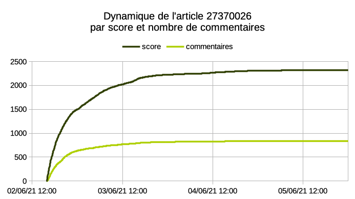
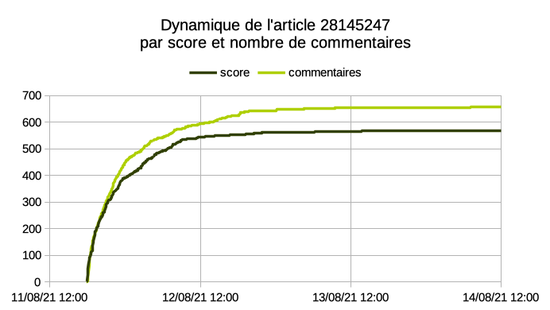
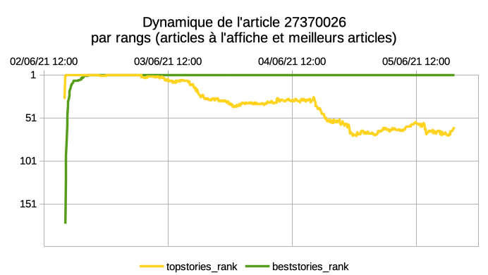
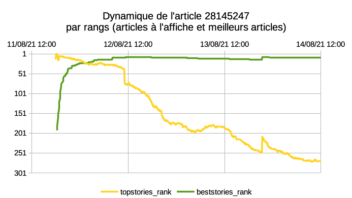

# PostgreSQL Hacker News ranker tool

***This side project is published for educational purposes and/or to serve as inspiration, it is not suitable for use in production!***<br>
*[Vous trouverez ici une traduction française de la page de présentation](README_FR.md)*

## Use case

Hn_ranker is an experimental project aimed at accumulating statistics monitoring popularity trend of submissions published on [Hacker News](https://news.ycombinator.com), a news aggregator about engineering mostly covering in the IT field.

This site rank submissions in an automated way bby relying mostly on social interactions.
This project goal is to accumulate data in a structured and adaptive way to analyze the dynamics of interactions (upvote/flags/number of comments) around each publication on this site.<br>
A secondary goal of this project is to build up a pretty large dataset to implement and test various OpenSource data-visualization software.

Choice of this website was motivated by its niche popularity and reasonable volumetric for a side project.
A public API without usage restriction is available and [documented](https://github.com/HackerNews/API) which is also ideal for this exercise.
In addition, the site community by its demography has long been interested in [reflections on the operation of the site](https://news.ycombinator.com/item?Id=1781013).

Finally, as an exercise, I chose to force myself to use PostgreSQL to develop this project in order to strengthen my skills around this tool (extension development, SQL, link with APIs, git, Makefile).

In order to allow continuous collection with an interval of 5 minutes, the application is deployed on a modestly sized VPS (25GB single-core) located in California near the server hosting the API to minimize latency.
At the time of writing, the currently deployed version performed 104,124 collection cycles for 324,081 articles tracked in the database and 25,564,675 rows in the "run_story" tracking table.


## How does it work in a nutshell?

The project is packaged as a PostgreSQL extension containing the table structure and functions to collect data from the Hacker News API.
Part of the code in charge of HTTP calls has been forked in a separate extension because of its own interest. This extension [pg_pmwget](https://github.com/MarHoff/pg_pmwget) is therefore a mandatory dependency of the installation.
The extension objects are installed in the specific schema "hn_ranker", the tables containing the results are marked as *pg_extension_config_dump* so as to be saved when using *pg_dump*.

Collection cycle is driven by the call to the procedure **hn_ranker.do_all()** which in the case of the production server is called every 5 minutes by the cron utility. The procedure is actually only used to control the call to sub-procedures in charge of the two steps of each cycle.

### Step 1 - Collecting global rankings
```sql
CALL hn_ranker.do_run();
```
The API is asked to retrieve the three rankings available on Hacker News:
- Top stories https://news.ycombinator.com/news
- Best stories https://news.ycombinator.com/best
- New stories https://news.ycombinator.com/newest

The lists of identifiers are published by the API as a JSON array for each of the rankings reflecting the order of the articles, the result is stored by a single row in the table **hn_ranker.run** and a unique identifier **run_id** (bigint) is assigned to the run.

Table schema **hn_ranker.run**:
|Name|Description|Example for run 104534<br>(2021-08-15 at 16:10 UTC)|
|----|-----|--|
|id          | Run identifier| 104534| 
|ts_run      | Timestamp at the beginning of the run | 2021-08-15 16:10:01.216029+00| 
|topstories  | Unique ID of top stories (array)|  {28187675,28177763,28188255,28188704,...}| 
|beststories | Unique ID of best stories (array)|{28162412,28156831,28172490,28160673,...}| 
|newstories  | Unique ID of new stories (array)|{28189890,28189836,28189813,28189799,...}| 
|ts_end      | Timestamp at the end of the run| 2021-08-15 16:10:01.496679+00| 

### Etape 2 - Collecting targeted individual stories<br>
```sql
CALL hn_ranker.do_run_story():
```
Using the previous rankings and statistics from previous collections, an algorithm classifies and determines which items will be collected to retrieve additional attributes (score and number of comments). The results are stored in the **run_story** table with a reference to the session ID **run_id**.

Table schema\* **hn_ranker.run_story**:
|Name|Description|Example for submission [28172269](https://news.ycombinator.com/item?id=28172269)<br>(2021-08-15 at 16:10 UTC)|
|----|-----|--|
|run_id           | Run identifier |  104534 |
|story_id         | Unique ID of submission |  28172269 |
|status           | Classification of the submission for this run |  hot |
|score            | Score obtained on Hacker News|  577 |
|descendants      | Number of comments on Hacker News |  724 |
|ts_payload       | Timestamp for this article fetch |  2021-08-15 16:10:57.231459+00 |

*\*NB: Additional deprecated fields may be present in the structure of the actual table on the master branch*

## Example of graphical visualization

|Submission 27370026 ([source](https://news.ycombinator.com/item?id=27370026))|Submission 28145247 ([source](https://news.ycombinator.com/item?id=28145247))|
|-|-|
|Stack Overflow sold to Prosus for $1.8B (wsj.com)|1Password 8 will be subscription only and won’t support local vaults (1password.community)|
|||
|||
|Data [27370026.csv](media/27370026.csv)|Data [28145247.csv](media/28145247.csv)|

```sql
--SQL query used to generate theses graphics
SELECT
  to_char(run.ts_run,'YYYY-MM-DD HH24:MI:SS') ts_run,
  run_story.run_id,
  run_story.story_id,
  array_position(run.topstories, run_story.story_id) topstories_rank,
  array_position(run.beststories, run_story.story_id) beststories_rank,
  array_position(run.newstories, run_story.story_id) newstories_rank,
  run_story.status status,
  run_story.score score,
  run_story.descendants descendants
FROM hn_ranker.run_story
  JOIN hn_ranker.run ON run_story.run_id=run.id
WHERE story_id='27370026'
ORDER by ts_run;
```

### Details about the submission classification algorithm

The first minutes and hours after a publication are crucial to analyze interaction dynamics that determine whether an article will be able to maintain a suitable score on the main page (topstories) for a long time. Conversely, old articles evolve very little or more at all.

The algorithm compute for each cycle a list of all the submissions already in database (or newly submitted) and calculates their status according to configurable sets of rules. It is the current status, the number of previous collections in the current status and the date of last collection of each submission that will determine whether it will be collected during the next cycle.

#### Collection statuses and rules for the *production* setting
| Possible statuses in descending order| Status condition | Collection rule |
|------------------|------------------------- |----------------------|
|new | New publication <br>*AND* status retention **new** for the first 12 cycles| Collects every 5 minutes|
|hot | The previous status was **new** <br>*OR* the publication is in the top 30 of the topstories/beststories ranking <br>*AND* status retention **hot** for at least 6 cycles| Collect every 5 minutes |
|tepid | The publication is in the top 60 of the topstories/beststories/newstories ranking | Collection if the last collection was more than 19 minutes ago |
|cooling | The previous status was higher than cooling <br>*AND* status retention for at least 12 cycles | Collection if the last collection was more than 59 minutes ago |
|cold | The previous status was greater than **cold** and retention of the status **cold** for at least 2 cycles | Collection if the last collection was more than 6 hours ago |
|unknown | Reserved status for a manual assignment with a status greater than **frozen** | Cannot be assigned automatically will be collected with the rules of **frozen** |
|frozen | The previous status was greater than or equal to **frozen** | Collection if the last collection was more than 7 days ago with spread over several cycles in case of large volumes to be processed. |
|missing | API collection returns an empty response for this publication| Will be re-tested up to 4 times with **tepid** status on success |
|failed | API collection returns an error for this publication| Will be retested up to 4 times with **tepid** status on success |
|deleted | The API explicitly returns the **deleted** status for this publication | Never re-tested again |
|unexpected| Error status in the event that the attribution algorithm cannot calculate a consistent status | No action, this is an error that must be audited if articles with this status are detected as a database|

### Settings

It is possible to fine-tune these parameters by editing settings in the **rule** and **ruleset** tables. The default behavior when functions are called without parameters is to follow the "production" ruleset. In a debug context it may be useful, for example, to use a different ruleset to allow faster rotation of the status of each publication.

## Why shouldn't you use this in production?

This project was developed as a side project and would require several improvements before being considered stable. The **develop** branch is also exploring the possibility of switching from a *"bigint"* run unique ID to a *"timestamp"* ID as the use of an non-natural unique identifier may have been problematic in the management of incidents involving a reset of the run ID.

For a long time, this project remained private/masked because I didn't deemed it polished enough to be presented.
But in reality it is probably always more interesting to share even  unfinished projects because the path is often as interesting as the result.

In addition, since a VPS I own run the application with a historical dataset of about 2 years, it would probably be counterproductive to start a new instance without coordination. Do not hesitate to contact me beforehand to discuss if you are interested in the project: contact \<at\> marhoff \<dot\> xyz

## Installation

### Note on the build system
This side project led me to test how **Make** works and develop a build system based on it.
The develop branch is much more advanced in this sense and is a better starting point to explore the codebase.
This effort probably classify as an ugly personal script to extend [PGXS](https://www.postgresql.org/docs/current/extend-pgxs.html).

### Prerequisites: recommended packages to run the test suite

(Tested under Debian and PostgreSQL 12)
```sh
postgresql-12
postgresql-contrib-12
postgresql-server-dev-12
postgresql-common
postgresql-12-pgtap
postgresql-12-plsh
libtap-parser-sourcehandler-pgtap-perl
git-core
git-gui
git-doc
build-essential
parallel
```

### Installing pg_pmwget as prerequisites
```sh
git clone https://github.com/MarHoff/pg_pmwget.git
cd pg_pmwget
make build #Optional for the stable version
make install
```

### Installation as a PostgreSQL extension
```sh
git clone https://github.com/MarHoff/pg_hn_ranker.git
cd pg_hn_ranker
make build #Optional for the stable version
make install
#A basic test suite is present in a more usable state on the **develop** branch. Executing the make command without argument will display basic usage instructions for test suite.
```

### Enabling the extension in a PostgreSQL database
```sql
CREATE EXTENSION pg_hn_ranker CASCADE;
```

### Note about PostgreSQL configuration tuning

While in most case it's recommended to fine tune *log_temp_files*, *log_min_duration_statement* and *track_activity_query_size* to learn about resources heavy query they should probably be kept them disabled altogether (usually the default setting) if you want to run pg_hn_ranker as intended.
The typical setup would be to call the hn_ranker.do_all() at regular intervals (typically every 5 minutes) an each call will probably trigger logging of the query. When theses parameters are ill defined it could lead to uses as much storage for pretty useless logging than for the actual data.
