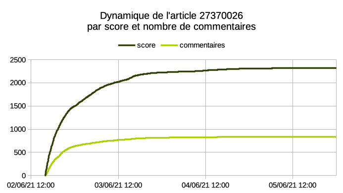
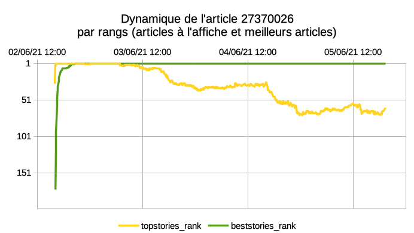
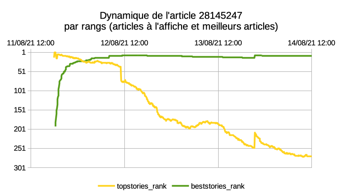

# PostgreSQL Hacker News ranker tool

***Ce projet personnel est publié à des fins pédagogiques et/ou pour servir d'inspiration, il n'est pas adapté à l'usage en production!***<br>
*[Go back to english version of this readme](README.md)*

## Utilisation

hn_ranker est projet expérimental visant à accumuler des statistiques sur l'évolution de popularité des articles publiées sur [Hacker News](https://news.ycombinator.com), un site social anglophone qui agrège les actualités dans le domaine de l'ingénierie en particulier dans le domaine IT.

Le principe de ce site est de hiérarchiser l'information de manière automatisée uniquement en fonction des interactions sociales.
Ce projet vise à accumuler de manière structurée et adaptative des données permettant d'analyser les dynamiques d'interactions (upvote/flags/nombre de commentaires) autour de chaque publication de news sur ce site.<br>
Le but annexe de cette démarche étant de constituer une masse de données conséquente permettant de mettre en application et de tester différents logiciels de data-visualisation OpenSource.

Le choix du site a été motivé par sa popularité de niche et une volumétrie raisonnable pour une démarche de projet personnel.
Une API publique sans restriction d'usage est disponible et [documentée](https://github.com/HackerNews/API) ce qui est également idéal pour cet exercice.
En outre la communauté du site par sa démographie est depuis longtemps intéressée par [des réflexions sur le fonctionnement du site](https://news.ycombinator.com/item?id=1781013).

A titre d'exercice enfin j'ai choisi de m'astreindre à utiliser PostgreSQL pour développer ce projet afin renforcer mes compétences autour de cet outil (développement d'extensions, SQL, lien avec des API, git, Makefile).

Afin de permettre la collecte en continue avec une intervalle de 5 minutes, l'application est déployée sur un VPS modestement dimensionné (monocœur 25GB) localisé en Californie près du serveur hébergeant l'API pour réduire au maximum la latence.
Au moment de la rédaction la version actuellement déployée à effectué 104 124 cycles de collectes pour 324 081 articles suivis dans la base et 25 564 675 lignes dans la table de suivi "run_story".


## Comment ça fonctionne dans les grandes lignes?

Le projet est packagé sous forme d'une extension PostgreSQL contenant la structure des table et les fonctions permettant de collecter les données depuis l'API de Hacker News.
La partie du code en charge des appels HTTP a été forkée dans une extension séparée en raison de son intérêt propre. Cette extension [pg_pmwget](https://github.com/MarHoff/pg_pmwget) constitue donc une dépendance obligatoire de l’installation.
Les objets de l'extension sont installés dans le schéma spécifique "hn_ranker", les tables contenant les résultats sont marquées comme des *pg_extension_config_dump* de manière à être sauvegardées lors de l'utilisation de *pg_dump*.

Le cycle de collecte est piloté par l'appel à la procédure **hn_ranker.do_all()** qui dans le cas du serveur de production est appelée toutes les 5 minutes par l'utilitaire cron. La procédure ne sert en réalité qu'à contrôler l'appel aux sous-procédures en charge des deux étapes qui constituent chaque cycle.

### Etape 1 - Récupération des classements d'articles
```sql
CALL hn_ranker.do_run();
```
L'API est sollicitée pour récupérer les trois classements disponibles sur Hacker News:
- Articles à l'affiche (topstories) https://news.ycombinator.com/news
- Meilleurs articles (beststories) https://news.ycombinator.com/newest
- Nouveaux articles (newstories) https://news.ycombinator.com/best

Les listes d’identifiants livrées sous forme de tableau pour chacun des classements reflètent l'ordre des articles, le résultat est stocké par une ligne unique dans la table **hn_ranker.run** et un identifiant unique **run_id** (bigint) est attribué à la session.

Structure de la table **hn_ranker.run**:
|Nom|Description|Exemple pour le cycle 104534<br>(le 15/08/2021 à 16h10 UTC)|
|----|-----|--|
|id          | Identifiant du cycle| 104534| 
|ts_run      | Horodatage du début du cycle | 2021-08-15 16:10:01.216029+00| 
|topstories  | Numéros uniques des article à l'affiche (tableau ordonné)|  {28187675,28177763,28188255,28188704,...}| 
|beststories | Numéros uniques des meilleurs articles (tableau ordonné)|{28162412,28156831,28172490,28160673,...}| 
|newstories  | Numéros uniques des nouveaux articles (tableau ordonné)|{28189890,28189836,28189813,28189799,...}| 
|ts_end      | Horodatage de la fin du cycle | 2021-08-15 16:10:01.496679+00| 

### Etape 2 - Récupération des infos individuelles pour les articles sélectionnés<br>
```sql
CALL hn_ranker.do_run_story():
```
A partir des classements récupérés et d'un ensemble de statistiques issues des collectes précédentes un algorithme classifie et détermine quels seront les articles collectés pour récupérer des attributs complémentaires (score et nombre de commentaires). Les résultats sont stockés dans la table **run_story** avec une réference à l'identifiant de session **run_id**.

Structure\* de la table **hn_ranker.run_story**:
|Nom|Description|Exemple pour l'article [28172269](https://news.ycombinator.com/item?id=28172269)<br>(le 15/08/2021 à 16h10 UTC)|
|----|-----|--|
|run_id           | Identifiant du cycle |  104534 |
|story_id         | Numéro unique de l'article |  28172269 |
|status           | Classification de l'article après collecte |  hot |
|score            | Score obtenu sur Hacker News |  577 |
|descendants      | Nombre de commentaires publiés sur Hacker News |  724 |
|ts_payload       | Horodatage de l'appel à l'API pour cet article |  2021-08-15 16:10:57.231459+00 |


*\*NB: Des champs supplémentaires dépréciés peuvent être présent dans la structure de la table réelle sur la branche master*

## Exemple d'exploitation graphique

|Article 27370026 ([source](https://news.ycombinator.com/item?id=27370026))|Article 28145247 ([source](https://news.ycombinator.com/item?id=28145247))|
|-|-|
|Stack Overflow sold to Prosus for $1.8B (wsj.com)|1Password 8 will be subscription only and won’t support local vaults (1password.community)|
|||
|||
|Données [27370026.csv](media/27370026.csv)|Données [28145247.csv](media/28145247.csv)|

```sql
--Requête sql utilisée pour générer les graphiques
SELECT
  to_char(run.ts_run,'YYYY-MM-DD HH24:MI:SS') ts_run,
  run_story.run_id,
  run_story.story_id,
  array_position(run.topstories, run_story.story_id) topstories_rank,
  array_position(run.beststories, run_story.story_id) beststories_rank,
  array_position(run.newstories, run_story.story_id) newstories_rank,
  run_story.status status,
  run_story.score score,
  run_story.descendants descendants
FROM hn_ranker.run_story
  JOIN hn_ranker.run ON run_story.run_id=run.id
WHERE story_id='27370026'
ORDER by ts_run;
```

### Précisions sur l'algorithme de classification des articles

Les première minutes et heures suivant une publication sont cruciales dans l'analyse des dynamiques d'interactions qui déterminent directement si un article arrivera à maintenir un score lui permettant de rester à l'affiche pendant une longue période. A l'inverse les vieux articles évoluent très peu voir plus du tout.

L'algorithme constitue pour chaque cycle une liste de l'ensemble des articles en base (ou nouvellement soumises) et calcul leur statuts en fonction de jeux de règles paramétrables. C'est le statut actuel,le nombre de collecte précédentes dans le statut actuel et la date de dernière collecte de chaque article qui déterminera s'il sera collecté à l'occasion du cycle courant.

#### Statuts et conditions de collecte avec le réglage *production*
| Statuts possibles par ordre décroissant| Condition pour le statut | Règle de la collecte |
|------------------|------------------------- |----------------------|
|new | Nouvelle publication <br>*ET* conservation du statut **new** pour les 12 premiers cycles| Collecte toutes les 5 minutes|
|hot | Le statut précédent était **new** <br>*OU* la publication figure dans le top 30 du classement topstories/beststories <br>*ET* conservation du statut **hot** pour 6 cycles au moins| Collecte toutes les 5 minutes |
|tepid | La publication figure dans le top 60 du classement topstories/beststories/newstories | Collecte si la dernière collecte remonte à plus de 19 minutes |
|cooling | Le statut précédent était supérieur à cooling <br>*ET* conservation du status pour 12 cycles au moins | Collecte si la dernière collecte remonte à plus de 59 minutes |
|cold | Le statut précédent était supérieur à **cold** et conservation du status **cold** pour 2 cycles au moins | Collecte si la dernière collecte remonte à plus de 6 heures |
|unknown | Statut réservé pour une affectation manuelle avec un statut supérieur à **frozen** | Ne peut pas être assigné automatiquement sera collecté avec les règles de **frozen** |
|frozen | Le statut précédent était supérieur ou égal à **frozen** | Collecte si la dernière collecte remonte à plus de 7 jours avec étalement de la collecte sur plusieurs cycles en cas de gros volume a traiter.|
|missing | La collecte de l'API renvoi une réponse vide pour cette publication| Sera re-testée 4 fois maximum avec le statut **tepid** en cas de succès |
|failed | La collecte de l'API renvoi une erreur pour cette publication| Sera re-testée 4 fois maximum avec le statut **tepid** en cas de succès |
|deleted | L'API renvoi explicitement le statut **deleted** pour cette publication | Plus jamais re-testé |
|unexpected| Statut d'erreur dans le cas ou l'algorithme d'attribution n'arrive pas à calculer un statut cohérent | Aucune action il s'agit d'une erreur qui doit être auditée si des articles avec ce statut sont détectées en base|

### Paramétrage

Il est possible de configurer finement ces paramètres en éditant les jeux de réglages dans les tables **rule** et **ruleset**. Le comportement par défaut si les fonctions sont appelés sans paramètre est de suivre le jeu de règle "production". Dans un contexte de debug il peut être utile par exemple d'utiliser un jeu de règle différent pour permettre une rotation plus rapide du statut de chaque publication.

## Pourquoi ne pas utiliser cela en production?

Ce projet répond à une problématique d'étude spécifique et nécessiterait plusieurs améliorations avant d'être considéré comme stable. La branche develop explore d'ailleurs la possibilité de basculer d'un identifiant de cycle du type *bigint* vers *timestamp* tant l'utilisation d'un identifiant unique non-naturel à pu être problématique dans le cadre de la gestion d'incidents impliquant un reset du nombre de cycle.

Pendant longtemps ce projet est d'ailleurs resté privé/masqué parce que je ne le trouvait pas assez abouti pour être présenté.
Mais en réalité il est sans doute toujours plus intéressant de partager ses projets inachevés car le chemin souvent tout aussi intéressant que le résultat.

En outre attendu qu'un VPS fait tourner l'application avec un recul d'environ 2 ans il serait sans doute contre-productif de démarrer une nouvelle instance sans concertation. N’hésitez pas à me contactez au préalable pour en discuter si le projet vous intéresse : contact <at> marhoff <point> xyz

## Installation

### Note sur le système de build
Ce projet personnel m'a conduit à tester le fonctionnement de Make et à mettre au point un systeme de build basé sur celui-ci.
La branche develop est beaucoup plus aboutie dans ce sens et il est préférable d'ausculter le code dans celle-ci pour s'en faire une idée.
Cela reste évidement de l'ordre du bricolage dans le cadre d'un projet personnel et l'essentiel de la procédure reste gérée par [PGXS](https://www.postgresql.org/docs/current/extend-pgxs.html) que mes scripts ne font qu'étendre.

### Prérequis : paquets recommandés pour faire tourner la suite de test

(testé sous Debian et PostgreSQL 12)
```sh
postgresql-12
postgresql-contrib-12
postgresql-server-dev-12
postgresql-common
postgresql-12-pgtap
postgresql-12-plsh
libtap-parser-sourcehandler-pgtap-perl
git-core
git-gui
git-doc
build-essential
parallel
```

### Installation de pg_pmwget comme prérequis
```sh
git clone https://github.com/MarHoff/pg_pmwget.git
cd pg_pmwget
make build #Optionnel pour installer la version stable
make install
```

### Installation comme extension de PostgreSQL
```sh
git clone https://github.com/MarHoff/pg_hn_ranker.git
cd pg_hn_ranker
make build #Optionnel pour installer la version stable
make install
#Une suite de test embryonnaire est présente mais il recommander de travailler plutôt sur la branche develop. Executer la commande make sans argument permettra d'afficher les optionns disponibles.

```

### Activation de l'extension dans PostgreSQL
```sql
CREATE EXTENSION pg_hn_ranker CASCADE;
```